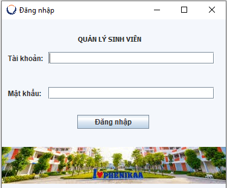
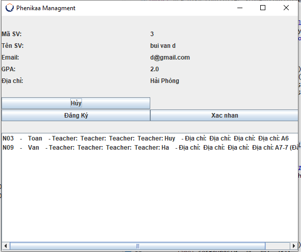

# oop_group9_1_1_24_N02
# Hệ thống Quản lý và Đăng ký môn học cho sinh viên.
# Giới thiệu dự án
Dự án này là một hệ thống giúp quản lý thông tin sinh sinh viên đối với đội ngũ quản lý đào tạo, đồng thời giúp sinh viên có thể đăng ký môn học.
# Thành viên nhóm
-Bùi Văn Bằng:Phát triển chức năng và giao diện cho chức năng đăng nhập của sinh viên, quản lý môn học. 
-Nguyễn Xuân Nguyên Hưng: Phát triển chức năng và giao diện cho chức năng đăng nhập admin, quản lý sinh viên. 
-Võ Hữu Thuận:Phát triển phần mềm.
# Chức Năng chính
-Thêm,sửa,xóa,tìm kiếm,sắp xếp Sinh viên 
-Đăng ký,Hủy môn học cho sinh viên 
-Lưu thông tin Sinh viên vào File 
-Lưu thông tin tình trạng môn học vào File

# Sơ đồ chức năng (Structural Diagram)

# Lưu đồ thuật toán (Behavioural Diagram)

Chức năng tìm kiếm thông tin sinh viên 

Chức năng cập nhật sinh viên

Chức năg xóa sinh viên 

# Giao diện Login đầu tiên của dự án:

# Giao diện Quản lý sinh viên:

# Giao diện sinh viên đăng ký môn:

